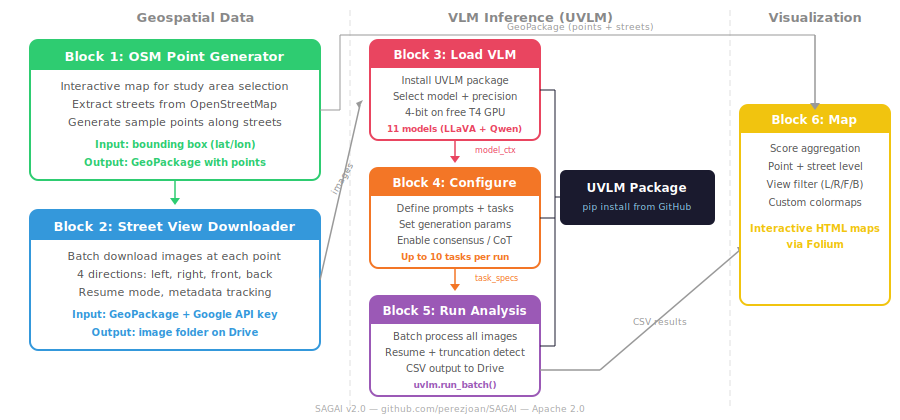

# Streetscape Analysis with Generative AI (SAGAI)

[](LICENSE)
[](https://github.com/perezjoan/SAGAI/releases)
[](https://colab.research.google.com/)
[](https://github.com/perezjoan/UVLM)

**SAGAI** is an open-source workflow for scoring and mapping street-level urban environments using **Vision-Language Models (VLMs)**. It automates the full pipeline: from street sampling via OpenStreetMap, to imagery retrieval via Google Street View, multi-model VLM scoring via **[UVLM](https://github.com/perezjoan/UVLM)**, and geospatial aggregation into thematic maps.

Starting with v2.0, SAGAI is a **single unified Google Colab notebook** with six sequential blocks. VLM inference is powered by the UVLM package, which supports **11 model checkpoints** across two families (LLaVA-NeXT and Qwen2.5-VL) with multi-task prompting, consensus validation, and chain-of-thought reasoning.

💡 **Zero-shot. Multi-model. Prompt-based. One notebook.**

---

## 🌍 What Does SAGAI Do?

SAGAI combines open-access geospatial tools with vision-language AI into a single pipeline:

- ✅ **OpenStreetMap (OSM)** — automatic extraction of street networks within a bounding box, with configurable point sampling along streets
- 📸 **Google Street View API** — batch downloading of street-level images at each point, with multi-directional capture (left, right, front, back)
- 🧠 **UVLM** — unified inference across 11 VLM checkpoints (LLaVA-NeXT + Qwen2.5-VL), with multi-task prompting, consensus validation, and reasoning support
- 🗺️ **GeoPandas + Folium** — geospatial aggregation and interactive HTML map generation at point and street levels

No pretraining, no fine-tuning, no human annotation required. Define your scoring tasks as natural language prompts and run them at scale.

---

## 📐 Architecture

SAGAI v2.0 is organized as a single Colab notebook with **six sequential blocks**:



| Block | Function | Description |
|-------|----------|-------------|
| **Block 1** | OSM Point Generator | Interactive map for defining a study area. Extracts streets from OSM and generates sample points along them. |
| **Block 2** | Street View Downloader | Batch downloads Google Street View images at each point in up to 4 directions. Requires a Google Maps API key. |
| **Block 3** | VLM Loader (UVLM) | Installs the [UVLM package](https://github.com/perezjoan/UVLM) and loads a selected model with quantization and device placement. |
| **Block 4** | Task Configuration | Defines analysis tasks (prompt, task type, format), generation parameters, and consensus settings via interactive widgets. |
| **Block 5** | Run Analysis | Processes all images through the configured tasks using UVLM's batch engine. Outputs a CSV with one row per image. |
| **Block 6** | Aggregation & Mapping | Aggregates image-level scores to point and street levels. Generates interactive HTML maps with Folium. |

Blocks 1–2 handle geospatial data. Blocks 3–5 handle VLM inference via UVLM. Block 6 handles visualization. Each block can be re-run independently.

---

## 🚀 Quick Start

SAGAI runs in **Google Colab** with no local installation required.

[](https://colab.research.google.com/github/perezjoan/SAGAI/blob/main/SAGAIv2.ipynb)

1. **Open the notebook** in Google Colab (link above)
2. **Select a GPU runtime**: `Runtime` → `Change runtime type` → `T4 GPU`
3. **Block 1**: Draw a bounding box on the map to define your study area. Click "Generate points" to sample along streets.
4. **Block 2**: Enter your Google Maps API key. Click "Download images" to fetch Street View imagery at each point.
5. **Block 3**: Select a VLM model (e.g., Qwen2.5-VL 7B, 4-bit) and click "Load model".
6. **Block 4**: Define your scoring tasks — write a prompt, choose a task type (numeric/category/boolean/text), set generation parameters. Click "Apply".
7. **Block 5**: Run the analysis. Results are saved as CSV to Google Drive.
8. **Block 6**: Select a score column, an aggregation method, and a view filter. Generate interactive maps.

### Prerequisites

- A **Google account** (for Colab and Drive)
- A **Google Maps API key** with Street View Static API enabled (for Block 2)
- A **Hugging Face token** stored in Colab secrets (for gated models like LLaMA3-based checkpoints — optional for public models like Qwen)

---

## 🧠 VLM Engine: UVLM

Blocks 3–5 are powered by **[UVLM](https://github.com/perezjoan/UVLM)** (Universal Vision-Language Model Loader), a separate open-source package that provides:

- **11 model checkpoints** — 7 LLaVA-NeXT + 4 Qwen2.5-VL, from 3B to 110B parameters
- **Dual-backend abstraction** — automatically routes to the correct inference pipeline (LLaVA or Qwen)
- **Multi-task prompt builder** — up to 10 tasks per run, with four response types (numeric, category, boolean, text)
- **Consensus validation** — majority voting across 2–5 repeated inferences per task
- **Chain-of-thought reasoning** — adjustable token budget up to 1,500 for custom reasoning strategies
- **Truncation detection** — flags responses that hit the token limit
- **Batch processing** — resume mode, schema upgrade, checkpoint saves
- **4-bit quantization** — runs on free Colab GPUs (T4)

UVLM is installed automatically when you run Block 3. For standalone use outside SAGAI, see the [UVLM repository](https://github.com/perezjoan/UVLM).

---

## 📊 Example Outputs

Two pilot case studies from SAGAI v1.0 are included in this repository:

- **Nice, France** — A linear urban corridor following the Paillon Valley
- **Vienna, Austria** — A heterogeneous peri-urban area in the Penzing-Wolfersberg sector

🔗 [Download output archive (excluding Street View imagery)](output%20nice%20vienna%20SAGAI%20v1-0.zip)

Due to Google's Terms of Service, raw Street View images are not distributed.

---

## 📦 Repository Structure

```
SAGAI/
├── SAGAIv2.ipynb                       # Unified notebook (all 6 blocks)
├── README.md                           # This file
├── LICENSE                             # Apache License 2.0
├── .gitignore
├── VERSIONS.txt                        # Version history
├── figure_sagai_architecture.svg       # Architecture diagram
└── output nice vienna SAGAI v1-0.zip   # Example outputs from v1.0
```

---

## ⚠️ What Changed in v2.0

| Aspect | v1.x | v2.0 |
|--------|------|------|
| **Structure** | 4 separate notebooks | 1 unified notebook (6 blocks) |
| **VLM support** | LLaVA-only (inline code) | 11 models via UVLM package (LLaVA + Qwen) |
| **Multi-task** | Single task per run | Up to 10 tasks per run |
| **Consensus** | Not available | Majority voting (2–5 runs) |
| **Reasoning** | Not available | Chain-of-thought with adjustable token budget |
| **Truncation** | Not detected | Per-task truncation flags |
| **Dependencies** | Inline, fragile | UVLM package installed from GitHub |
| **Maps** | Matplotlib static | Folium interactive HTML maps |

---

## 📚 Citation

If you use SAGAI in your research, please cite:

> Perez, J. and Fusco, G. (2025). *Streetscape Analysis with Generative AI (SAGAI): Vision-Language Assessment and Mapping of Urban Scenes*. Geomatica, 77(2), 100063. Available at: https://www.sciencedirect.com/science/article/pii/S1195103625000199

If you use the UVLM engine specifically, please also cite:

> Perez, J. and Fusco, G. (2026). *UVLM: A Modular Python Package for Vision-Language Model Loading, Inference and Comparison*. arXiv:2603.13893. Available at: https://arxiv.org/abs/2603.13893

---

## 🪪 License and Attribution

SAGAI is released under the [Apache License 2.0](LICENSE).

Third-party components:

- [UVLM](https://github.com/perezjoan/UVLM) — Vision-language model inference engine (Apache 2.0)
- [LLaVA-NeXT](https://github.com/haotian-liu/LLaVA) — Visual instruction tuning models (Apache 2.0)
- [Qwen2.5-VL](https://github.com/QwenLM/Qwen2.5-VL) — Vision-language models (Apache 2.0)
- [Hugging Face Transformers](https://github.com/huggingface/transformers) — Model loading and inference (Apache 2.0)
- [OpenStreetMap](https://www.openstreetmap.org/copyright) — Street network data (ODbL 1.0)
- Google Street View imagery is accessed via API and subject to Google's [Terms of Service](https://maps.google.com/help/terms_maps/)

---

## ✨ Acknowledgments

This research is supported by the [emc2 project](https://emc2-dut.org/) co-funded by **ANR (France)**, **FFG (Austria)**, **MUR (Italy)**, and **Vinnova (Sweden)** under the **Driving Urban Transition Partnership**, which has been co-funded by the European Commission.

## 🏢 Developer

SAGAI is developed by [Joan Perez](https://orcid.org/0000-0003-3003-0895), founder of **Urban Geo Analytics** — an independent research and consulting practice focused on geospatial modeling, AI for cities, and open-source urban analytics. 🌐 [urbangeoanalytics.com](https://urbangeoanalytics.com/)

---

## 📫 Feedback and Contributions

Feel free to open an issue or pull request. Contributions and forks are welcome!

🔗 [GitHub Discussions](https://github.com/perezjoan/SAGAI/discussions) — Share use cases, ideas, and extensions.
